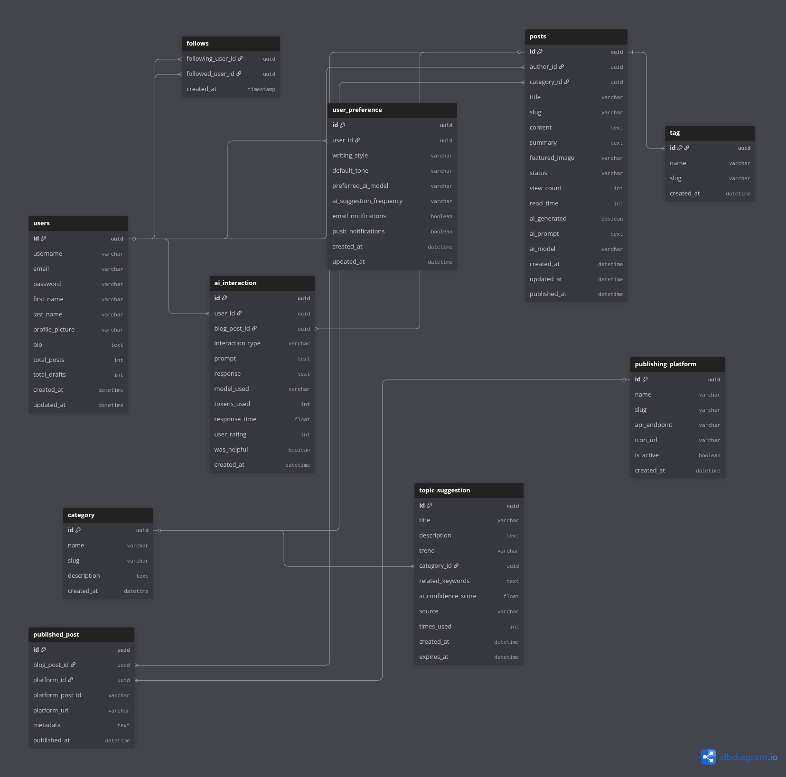

# AI Blog Writer

A full-stack AI-powered blog writing application that leverages Google's Gemini AI to help users create, improve, and manage blog content efficiently.

## 📋 Table of Contents
- [Overview](#overview)
- [Features](#features)
- [Architecture](#architecture)
- [Technology Stack](#technology-stack)
- [Getting Started](#getting-started)
- [Project Structure](#project-structure)
- [Screenshots](#screenshots)

## 🎯 Overview

AI Blog Writer is a comprehensive web application that combines the power of artificial intelligence with an intuitive user interface to streamline the blog writing process. The application uses Google's Gemini AI model to generate high-quality blog content, improve readability, summarize long texts, and discover trending topics—all while maintaining a user-friendly experience with both light and dark mode support.

## ✨ Features

### Core Capabilities
- **AI-Powered Article Generation**: Create complete blog articles from just a title using advanced AI
- **Content Improvement**: Enhance existing text for better readability and engagement
- **Smart Summarization**: Condense long articles into concise summaries
- **Trending Topics Discovery**: Find the latest trending blog topics in real-time
- **User Authentication**: Secure JWT-based authentication system
- **Blog Management**: Full CRUD operations for managing blog posts
- **Dual Theme Support**: Seamless switching between light and dark modes
- **Responsive Design**: Works perfectly across desktop, tablet, and mobile devices

## 🏗️ Architecture

The application follows a modern three-tier architecture:

```
┌─────────────────────────┐
│      Frontend           │  React + TypeScript + Vite
│      Port 5173          │  (User Interface)
└───────────┬─────────────┘
            │ HTTP/REST API
            ▼
┌─────────────────────────┐
│   Django Backend        │  Django REST Framework
│      Port 8000          │  (API Layer & Database)
└───────────┬─────────────┘
            │ HTTP Proxy
            ▼
┌─────────────────────────┐
│   AI/ML Backend         │  FastAPI + Google Gemini
│      Port 8001          │  (AI Processing)
└─────────────────────────┘
```

### How It Works

1. **Frontend Layer**: 
   - Built with React and TypeScript for type safety
   - Uses Vite for fast development and optimized production builds
   - Communicates with Django backend via REST API
   - Handles user authentication using JWT tokens
   - Provides real-time feedback for AI operations

2. **Django Backend Layer**:
   - Serves as the main API gateway
   - Manages user authentication and authorization
   - Handles database operations (SQLite for development)
   - Acts as a proxy to the AI/ML backend
   - Logs all AI interactions for analytics
   - Implements error handling and retry logic

3. **AI/ML Backend Layer**:
   - Built with FastAPI for high-performance async operations
   - Integrates with Google's Gemini AI model
   - Processes three main workflows:
     - **Generate**: Creates articles from titles
     - **Improve**: Enhances text readability
     - **Summarize**: Condenses content
   - Uses custom prompt engineering for optimal results
   - Includes comprehensive error handling

### Data Flow Example

When a user generates an article:

1. User enters a title in the frontend and clicks "Generate"
2. Frontend sends POST request to Django backend (`/api/ai/generate/`)
3. Django validates JWT token and user permissions
4. Django proxies request to FastAPI backend (`/api/v1/generate`)
5. FastAPI processes the request using Gemini AI
6. AI-generated content flows back through Django to Frontend
7. Frontend displays the generated article with formatting
8. User can save, edit, or regenerate as needed

## 🛠️ Technology Stack

### Frontend
- **React 18**: Modern UI library with hooks
- **TypeScript**: Type-safe JavaScript
- **Vite**: Next-generation frontend tooling
- **React Router**: Client-side routing
- **Axios**: HTTP client for API calls
- **CSS3**: Modern styling with animations

### Backend (Django)
- **Django 4.x**: High-level Python web framework
- **Django REST Framework**: Powerful REST API toolkit
- **JWT Authentication**: Secure token-based auth
- **SQLite**: Lightweight database for development
- **CORS Headers**: Cross-origin resource sharing

### AI/ML Backend (FastAPI)
- **FastAPI**: Modern, fast web framework
- **Google Gemini AI**: Advanced language model
- **Pydantic**: Data validation using Python type annotations
- **Uvicorn**: Lightning-fast ASGI server
- **Python 3.10+**: Latest Python features

## 🚀 Getting Started

### Prerequisites
- Python 3.10 or higher
- Node.js 16 or higher
- npm or yarn package manager
- Google Cloud API key for Gemini AI

### Quick Start (Automated)

```bash
# Make scripts executable
chmod +x start_services.sh stop_services.sh

# Start all services
./start_services.sh

# Stop all services
./stop_services.sh
```

### Manual Setup

#### 1. AI/ML Backend Setup
```bash
cd ai_ml_backend
python -m venv venv
source venv/bin/activate  # On Windows: venv\Scripts\activate
pip install -r requirements.txt

# Set your Google API key
export GOOGLE_API_KEY="your-api-key-here"

# Start FastAPI server
uvicorn src.fastapi_app:app --reload --port 8001
```

#### 2. Django Backend Setup
```bash
cd django_backend
python -m venv venv
source venv/bin/activate  # On Windows: venv\Scripts\activate
pip install -r requirements.txt

# Run migrations
python manage.py migrate

# Create superuser (optional)
python manage.py createsuperuser

# Start Django server
python manage.py runserver
```

#### 3. Frontend Setup
```bash
cd frontend
npm install

# Start development server
npm run dev
```

The application will be available at:
- Frontend: http://localhost:5173
- Django API: http://localhost:8000
- AI/ML API: http://localhost:8001

## 📁 Project Structure

```
ai_blog_writer/
├── frontend/                   # React TypeScript frontend
│   ├── src/
│   │   ├── components/        # Reusable UI components
│   │   ├── services/          # API service layer
│   │   ├── types/             # TypeScript type definitions
│   │   └── utils/             # Helper functions
│   └── vite.config.ts         # Vite configuration
│
├── django_backend/            # Django REST API
│   ├── blog/                  # Main blog app
│   │   ├── models.py          # Database models
│   │   ├── views.py           # API views
│   │   ├── serializers.py     # Data serializers
│   │   ├── ai_service.py      # AI backend client
│   │   └── urls.py            # URL routing
│   └── blog_project/          # Django project settings
│
├── ai_ml_backend/             # FastAPI AI service
│   └── src/
│       ├── fastapi_app.py     # Main FastAPI application
│       ├── workflows/         # AI workflow logic
│       ├── prompts/           # AI prompt templates
│       ├── models/            # AI model handlers
│       ├── services/          # Business logic
│       └── helpers/           # Utility functions
│
├── docs/                      # Documentation
├── screenshot/                # Application screenshots
└── start_services.sh          # Startup script
```

## 📸 Screenshots

# Welcome to the AI Blog Writer Application!


# Login Page


## Main Interface


## Write and create with titles


## Generate blog posts with prompts


## Find top trending blog topics


## Database of blog posts
