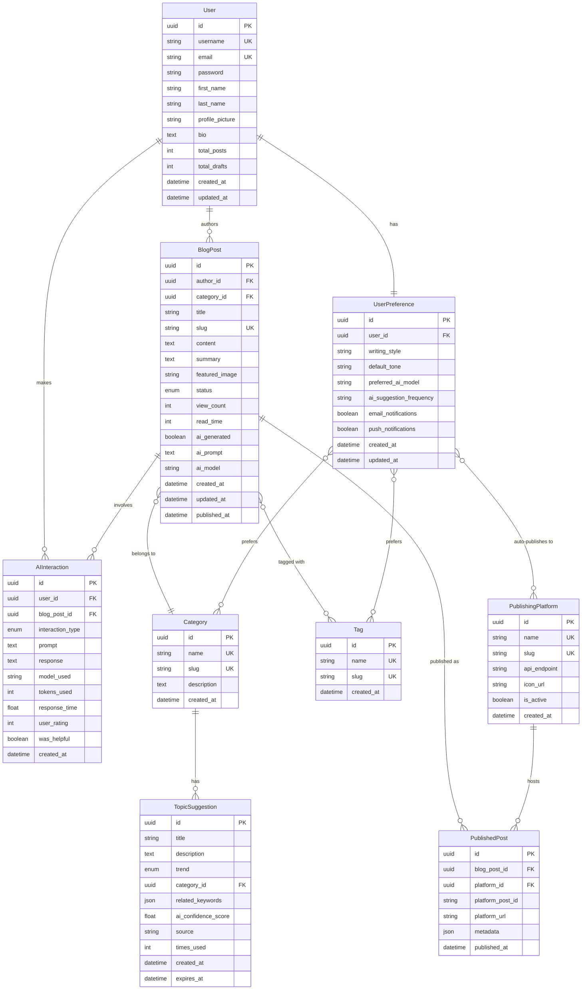

# Entity Relationship Diagram

## AI Blog Writer Database Schema

## Model Descriptions

### Core Entities

#### User
- Custom user model extending Django's AbstractUser
- Tracks total posts and drafts for statistics
- Supports profile customization

#### BlogPost
- Main content entity
- Tracks AI generation metadata
- Supports draft/published/archived states
- Includes SEO fields (slug, summary)
- Tracks view counts and read time

#### Category
- Organize posts by broad topics
- Slug for URL-friendly names
- One-to-many relationship with posts

#### Tag
- Fine-grained content classification
- Many-to-many relationship with posts
- Useful for search and filtering

### AI & Suggestions

#### TopicSuggestion
- AI-generated topic ideas
- Trend indicators (rising, hot, steady)
- Confidence scoring
- Expiration for time-sensitive topics

#### AIInteraction
- Analytics for all AI operations
- Tracks prompts, responses, and performance
- User feedback collection
- Token usage tracking

### Publishing

#### PublishingPlatform
- External platforms (Medium, Dev.to, etc.)
- API endpoint configuration
- Icon for UI display

#### PublishedPost
- Many-to-many bridge table
- Tracks where posts are published
- Stores platform-specific metadata
- Links to original post on platform

### User Settings

#### UserPreference
- Writing style and tone preferences
- AI model preferences
- Notification settings
- Default categories and tags
- Auto-publishing configuration

## Key Relationships

1. **User-BlogPost**: One user can author many posts
2. **BlogPost-Category**: Many posts can belong to one category
3. **BlogPost-Tag**: Many-to-many (posts can have multiple tags)
4. **BlogPost-PublishedPost**: One post can be published to multiple platforms
5. **User-UserPreference**: One-to-one relationship for settings
6. **User-AIInteraction**: Track all user interactions with AI

## Indexes

The models include indexes on:
- created_at (for sorting)
- status (for filtering)
- author + status (for user's post lists)
- trend (for topic suggestions)

## Data Types

- **UUID**: All primary keys for security and distribution
- **JSON**: For flexible metadata and keyword arrays
- **Enum/Choices**: For predefined options (status, trend, etc.)
- **DateTime**: Automatic tracking with auto_now and auto_now_add
- **Boolean**: Feature flags and settings
- **Float**: Scores and metrics

## Future Enhancements

Consider adding:
- **Comment** model for blog comments
- **Analytics** model for detailed post metrics
- **SavedDraft** model for auto-save functionality
- **Collaboration** model for co-authoring
- **Template** model for reusable post templates
- **Media** model for image/file management

// Use DBML to define your database structure
// Docs: https://dbml.dbdiagram.io/docs

Table User {
  id integer [primary key]
  username varchar [unique]
  email varchar [unique]
  first_name varchar
  last_name varchar
  profile_picture string
  bio text
  total_posts int
  total_draft int
  created_at timestamp
  updated_at timestamp
}

Table BlogPost {
  id integer [primary key]
  author_id varchar [unique]
  category_id varchar [unique]
  title varchar
  slug varchar [unique]
  text_content varchar
  text_summary varchar
  feature_image string
  status boolean
  view_count int
  read_time int
  ai_generated boolean
  ai_prompt text
  ai_model string
  created_at datetime
  updated_at datetime
  pubish_date datetime
}

Table Category {
  id uuid [primary key]
  name strinng [unique]
  slug string [unique]
  created_at datetime
}

Table TopicSuggestion {
  id uuid [primary key]
  title string
  description text
  trend enum
  category_id uuid [unique]
  related_keywords json
  ai_confidence_score float
  source string
  time_used int
  created_at datetime
  expire_at datetime
}

Table PublishingPlatform {
  id uuid [primary key]
  name string
  slug text
  api_endpoint string
  icon_url string
  is_active boolean
  created_at datetime
}

Table PublishedPost {
  id uuid [primary key]
  blog_post_id uuid [unique]
  platform_id uuid [unique]
  platform_post_id string
  platform_url string
  metadata json
  published_at datetime
}

Table AIInteraction { 
  
}

Ref user_posts: BlogPost.id > User.id // many-to-one

